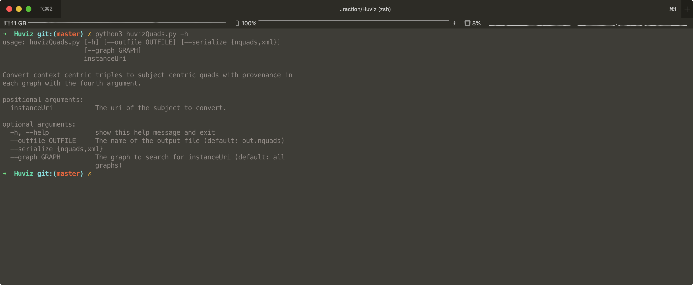
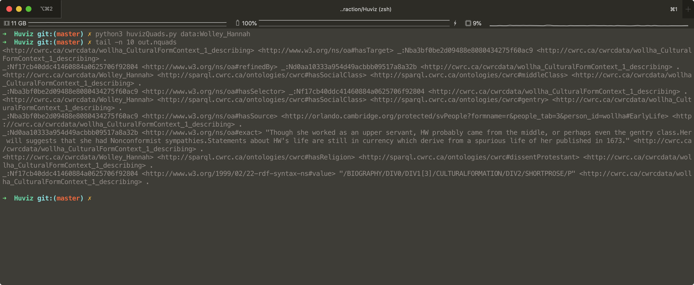

# Introduction

Tools for extrating triples and datasets for Huviz. 

## Quads Converter 

Quads Converter is a tool that converts CWRC context centric triples to 
Subject Centric triples with the 4th argument being the graph that contains
the original context triples. 

* Huviz Quads queries the latest data on the cwrc sparql endpoint
  by default it searchs across all graphs but this can be specified
* The library will search about 4 levels deep which covers existing
  cwrc use cases.
* The library will then convert each context into a quad with a graph
  that includes the original provenance information
  

	

### Usage

To use the converter python3 is required. 
With python3 run the script with the first argument being the instance uri
additional arguments can be seen by running with -h flag

The output will be generated in an out.nquads file, this is modified
through the outfile param

	

